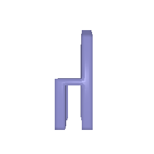
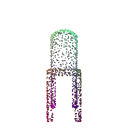
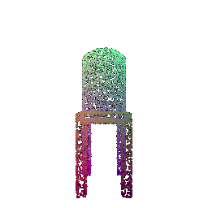
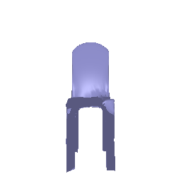
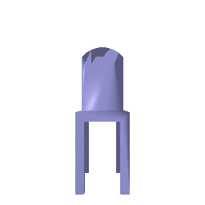

# CMU 16825 Assignment 2 - George Pan (fuchengp)

## Q1 Exploring Loss Functions

### Q1.1 Fitting a voxel grid

In this problem, we are asked to implement binary cross-entropy loss for voxel fitting. Below are the visualizations of the optimized voxel grid and the ground truth voxel grid.

**Optimized voxel grid**

**Ground truth voxel grid**

As we can see, fitting a random voxel grid into the target voxel grid with binary cross-entropy loss results in quite impressive result.

### Q1.2 Fitting a point cloud

In this problem, we aimed to fit a point loud to the target using chamfer loss which measure the distance between two point clouds by computing the average closest point distance between them in both directions. Below are the visualizations of the optimized point cloud and the ground truth point cloud.

**Optimized point cloud**

**Ground truth point cloud**

Similar to the voxel case, the source point cloud can fit to the target point cloud well with the use of chamfer loss function.

### Q1.3 Fitting a mesh

In this part, we defined an additional smoothness loss by minimizing the Laplacian of the mesh. Below are the visualizations of the resulting mesh and the ground truth mesh.

**Optimized mesh**

**Ground truth mesh**

Similarly, the smootheness loss allowed the source mesh to fit the ground truth mesh much smoother and better.
